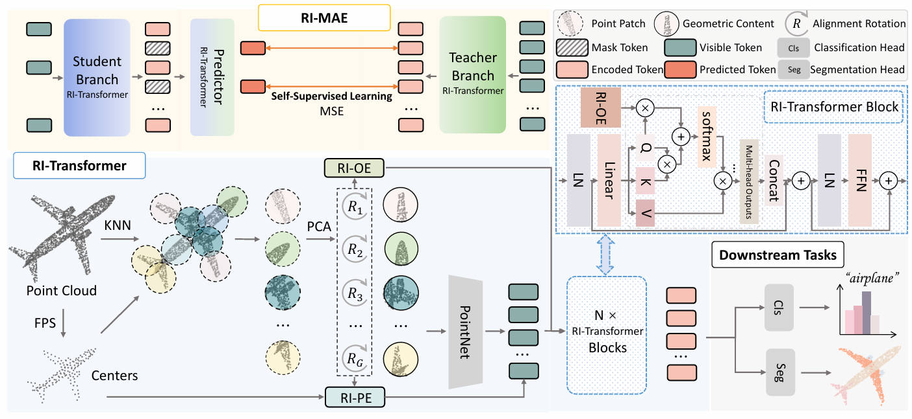

# RI-MAE

## RI-MAE: Rotation-Invariant Masked AutoEncoders for Self-Supervised Point Cloud Representation Learning, [ArXiv](https://arxiv.org/abs/2409.00353)

In this work, we propose a novel Rotation Invariant Masked AutoEncoders for self-supervised learning on point clouds, namely RI-MAE. We first propose a RI-Transformer backbone to derive rotation-invariant latent space, with effective RI-OE and RI-PE. Based on RI-Transformer, RI-MAE employs a dual-branch design enables masked point patches reconstruction without rotation interference.

<div  align="center">    
 
</div>

## 1. Requirements
PyTorch >= 1.7.0 < 1.11.0;
python >= 3.7;
CUDA >= 9.0;
GCC >= 4.9;
torchvision;

```
pip install -r requirements.txt
```

```
# Chamfer Distance & emd
cd ./extensions/chamfer_dist
python setup.py install --user
cd ./extensions/emd
python setup.py install --user
# PointNet++
pip install "git+https://github.com/erikwijmans/Pointnet2_PyTorch.git#egg=pointnet2_ops&subdirectory=pointnet2_ops_lib"
# GPU kNN
pip install --upgrade https://github.com/unlimblue/KNN_CUDA/releases/download/0.2/KNN_CUDA-0.2-py3-none-any.whl
```

### PyTorch3D Installation (Optional)
If you want to use the mesh ray casting feature for point cloud generation, you need to install PyTorch3D. See the [official installation guide](https://github.com/facebookresearch/pytorch3d/blob/main/INSTALL.md) for detailed instructions.

**Option 1: Using our Conda environment file (Recommended)**
```
# Create and activate conda environment with all dependencies
conda env create -f environment.yml
conda activate rimae

# Install custom extensions
cd ./extensions/chamfer_dist
python setup.py install --user
cd ../emd
python setup.py install --user
```

**Option 2: Manual installation of PyTorch3D dependencies**
```
# Install dependencies first
conda install -c pytorch pytorch=1.10.1 torchvision cudatoolkit=11.3
conda install -c iopath iopath
conda install -c bottler nvidiacub
conda install -c fvcore -c conda-forge fvcore

# Then install PyTorch3D 
conda install -c pytorch3d pytorch3d

# For older CUDA versions (<11.7), the CUB library is required
# It's already included via nvidiacub in our environment.yml
```

**Note**: If you encounter issues with PyTorch3D installation, you might need to install from source:
```
pip install "git+https://github.com/facebookresearch/pytorch3d.git@stable"
```

## 2. Datasets

We use ShapeNet, ScanObjectNN, ModelNet40 and ShapeNetPart in this work. See [DATASET.md](./DATASET.md) for details.

## 3. RI-MAE Models
|  Task | Dataset | Config | Acc. (z/z)| Acc. (SO3/SO3)| Acc. (z/SO3)|
|  ----- | ----- |-----|  -----|  -----|  -----|
|  Pre-training | ShapeNet |[pretrain.yaml](./cfgs/SSL_models/RI_MAE.yaml)| N.A. | N.A. | N.A. |
|  Classification | ScanObjectNN |[finetune_scan_objbg.yaml](./cfgs/ScanObjectNN_models/Transformer_objectbg.yaml)|91.9% |91.9% |91.9% |
| Part segmentation| ShapeNetPart| [Transformer_seg.yaml](./cfgs/ShapeNetPart_models/Transformer_seg.yaml)| 84.3% mIoU| 84.3% mIoU| 84.3% mIoU|
| Semantic segmentation| S3DIS| [Transformer_sem_seg.yaml](./cfgs/S3DIS_models/Transformer_sem_seg.yaml)| 60.3% mIoU| 60.3% mIoU| 60.3% mIoU|

|  Task | Dataset | Config | 10w10s Acc. (z/SO3)| 10w20s Acc. (z/SO3)|     
|  ----- | ----- |-----|  -----|-----|
|  Few-shot learning | ModelNet40 |[fewshot.yaml](./cfgs/Fewshot_models/Transformer_1k.yaml)| 90.2 ± 5.5| 93.7 ± 3.5| 

## 4. RI-MAE Pre-training
To pretrain RI-MAE on ShapeNet training set, run the following command. If you want to try different models or masking ratios etc., first create a new config file, and pass its path to --config.

```
CUDA_VISIBLE_DEVICES=<GPU> python main_RIMAE.py --config cfgs/SSL_models/RI_MAE.yaml --exp_name <output_file_name>
```
## 5. RI-MAE Fine-tuning

Fine-tuning on ScanObjectNN, run:
```
CUDA_VISIBLE_DEVICES=<GPUs> python main_RIMAE.py --config cfgs/ScanObjectNN_models/Transformer_objectbg.yaml \
--finetune_model --exp_name <output_file_name> --ckpts <path/to/pre-trained/model>
```
Few-shot learning, run:
```
CUDA_VISIBLE_DEVICES=<GPUs> python main_RIMAE.py --config cfgs/Fewshot_models/Transformer_1k.yaml --finetune_model \
--ckpts <path/to/pre-trained/model> --exp_name <output_file_name> --way <5 or 10> --shot <10 or 20> --fold <0-9>
```

## Acknowledgements

Our codes are built upon [Point-BERT](https://github.com/lulutang0608/Point-BERT), [Point-MAE](https://github.com/Pang-Yatian/Point-MAE), [Pointnet2_PyTorch](https://github.com/erikwijmans/Pointnet2_PyTorch) and [Pointnet_Pointnet2_pytorch](https://github.com/yanx27/Pointnet_Pointnet2_pytorch)

## Reference

```
@misc{su2024ri,
    title={RI-MAE: Rotation-Invariant Masked AutoEncoders for Self-Supervised Point Cloud Representation Learning},
    author={Su, Kunming and Wu, Qiuxia and Cai, Panpan and Zhu, Xiaogang and Lu, Xuequan and Wang, Zhiyong and Hu, Kun},
    year={2024},
    eprint={2409.00353},
    archivePrefix={arXiv},
    primaryClass={cs.CV}
}
```
